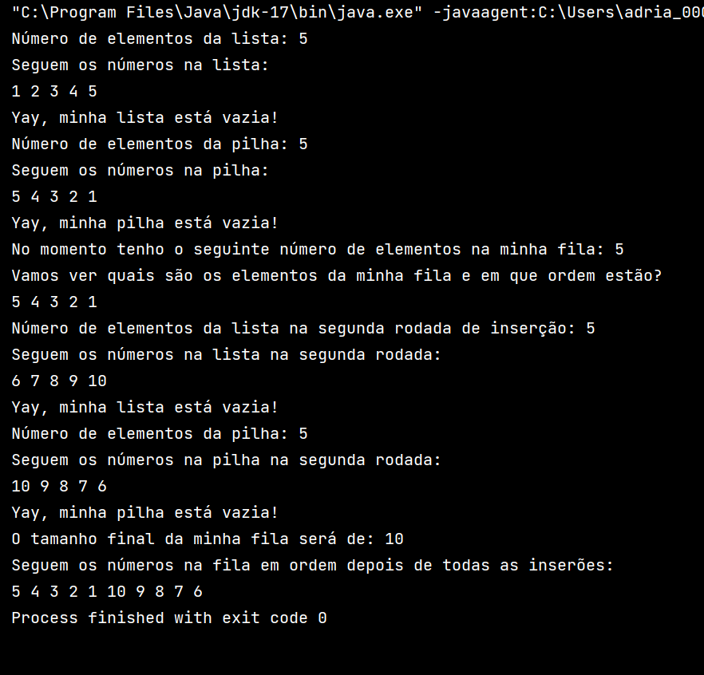

# Estrutura de Dados - Atividade 3 - Universidade Anhembi Morumbi - Nota recebida: 9
## Enunciado

Implemente um projeto no qual serão inseridos números de forma ordenada, e que atenda as especificações a seguir: 
 
- Passo 1: Insira os números [1, 2, 3, 4 e 5] em uma lista - com 5 células; 
- Passo 2: Remova todos os dados da lista e insira-os em uma estruturas.Pilha - com 5 células. Deve-se sempre remover os dados da célula inicial da lista; 
- Passo 3: Remova os dados da estruturas.Pilha e insira-os em uma estruturas.Fila - com 10 células); 
- Passo 4: Insira os números [6, 7, 8, 9 e 10] na lista; 
- Passo 5: Repita os passos 2 e 3. 
- Passo 6: Exiba todos os números que foram inseridos na fila. 
 
Analise a ordem dos números exibidos e verifique se estão na mesma forma que foram inseridos. Se a exibição foi diferente, justifique o ocorrido. 
 
O programa desenvolvido pelo aluno e a sua justificativa deverá ser postado em um ambiente virtual. Esse programa será avaliado pelo tutor responsável pela disciplina. 
## Resposta:

Nas estruturas de dados pedidas no enunciado temos os seguintes conceitos de ordenação:

A Lista é ordenada, portanto a ordem em que insiro os elementos será mantida ao usar um laço para iterar sobre os elementos.

Na Pilha temos o conceito LIFO (Last In First Out - Último a entrar, Primeiro a Sair), portando as iterações irão seguir esse conceito.

E na Fila usamos o FIFO (First In First Out - Primeiro a entrar, Primeiro a Sair), o que também será respeitado ao iterar sobre está estrutura.

Portanto, na nossa ordem primeiro passamos por uma Lista, depois colocamos os elementos dessa Lista em ordem em uma Pilha, esvaziando a Lista e depois os colocamos em uma Fila, esvaziando a Pilha. 

A impressão que vamos obter será:
A ordem da lista será:
```
1 2 3 4 5
```
Ou seja, manteve a ordem de inserção e o primeiro a ser colocado também foi o primeiro a sair.

A impressão da Pilha será:
```
5 4 3 2 1 
```
Isso porque o último a ser colocado foi o primeiro a sair, ou seja, a ordem foi invertida. O que quer dizer que ele entrou invertido na Fila. Mas a fila segue a ordem de inserção, portanto ao imprimir seguirá a ordem de entrada que também seria:
```
5 4 3 2 1 
```
Mas neste momento ainda não nos foi pedido de imprimir a fila. O que foi pedido foi de repetir o processo de inserção com os números de 6 a 10 na Lista e na Fila, que neste momento estão vazias. Isto novamente, devido ao exposto acima vai primeiro nos dar a impressão da Lista:
```
6 7 8 9 10 
```
e a impressão da Pilha
```
10 9 8 7 6
```
E como finalmente teremos a impressão da Fila resultante essa será com 10 elementos na seguinte ordem:
```
5 4 3 2 1 10 9 8 7 6 
```
Isso porque primeiro foram inseridos na Fila na ordem de saída da Pilha os números de 1 a 5 e depois na ordem de saída da Pilha os números de 6 a 10. Ou seja, foram inseridos os números invertidos de 1 a 5, e depois de novamente inverter os números de 6 a 10, foram inseridos estes números depois do último elemento da primeira inserção que era o 1.

Segue abaixo um print screen do console onde pode-se verificar o exposto acima e com a impressão do tamanho das estruturas percebemos que sempre foi respeitado o tamanho máximo de 5 células para a Lista e Pilha e o tamanho máximo de 10 células para a Fila:

